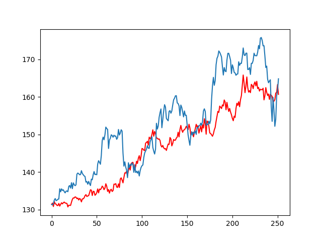

# Monte-Carlo Simulation
Utilising Brownian motion random walks to predict stock prices based on prior performance.

The actual predictor is enhanced by the numba library allowing for greatly reduced processing time.

(3&times;106 iterations in 62 seconds)

> Blue - Actual Stock Price

> Red - Predicted Stock Price